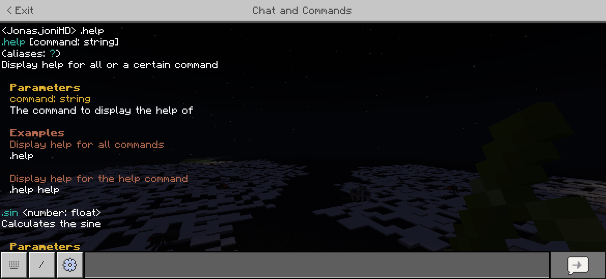

<p align="center">
    
    <h1 align="center">MCBE WebSocket Server</h1>
    <p align="center">A Minecraft: Bedrock Edition WebSocket implementation in Deno/TypeScript.</p>
</p>

> [!WARNING]
> `@bedrock-ws/bedrockws` and `@bedrock-ws/schema` are still in beta release.

```typescript
import { consts, Server } from "@bedrock-ws/bedrockws";

const server = new Server();

server.on("PlayerMessage", (event) => {
  const { client, data } = event;
  if ((Object.values(consts.names) as string[]).includes(data.sender)) {
    // don't react on messages sent by the server
    return;
  }
  client.run(`say ${data.message}`);
});
```

```typescript
import { Bot, floatParamType } from "@bedrock-ws/bot";
import type { Command, CommandArgument, CommandOrigin } from "@bedrock-ws/bot";

const sinCommand: Command = {
  name: "sin",
  description: "Calculates the sine",
  mandatoryParameters: [
    { type: floatParamType, name: "number" },
  ],
  examples: [{
    description: "Calculate the sine of 1",
    args: ["1"],
  }],
};

bot.cmd(sinCommand, (origin: CommandOrigin, ...args: CommandArgument[]) => {
  const { client } = origin;
  const n = args.shift() as number;
  client.sendMessage(`sin(${n}) = ${Math.sin(n)}`);
});
```

## Features

- **Markup**
  ```typescript
  import { style } from "@bedrock-ws/ui";
  assertEquals(style`<red>A<bold>B</bold>C</red>`, "§cA§lB§r§cC§r");
  ```
- **Pretty help command out of the box**
  
- ... and more

## Examples

You can configure the host and port in the `.env` file. See also
<https://docs.deno.com/runtime/reference/env_variables/>.

```console
deno run --env-file=.env -A src/bedrockws/examples/echo.ts
```

## Logging/Telemetry

Set the environment variable `BEDROCKWS_DENO_TELEMETRY` to `1` to enable
logging. Messages received from the Minecraft client(s) will be stored in
`.cache/bedrockws-deno` in your home directory.

## References

- <https://gist.github.com/jocopa3/5f718f4198f1ea91a37e3a9da468675c>
- <https://github.com/Sandertv/mcwss/tree/master>
- <https://www.s-anand.net/blog/programming-minecraft-with-websockets/>

## License

`bedrockws-deno` is licensed under Apache 2.0 with exceptions of `src/mapart`
and `src/ui` which are licensed under MIT. Further information can be found in
the license files of the subdirectories accordingly.
